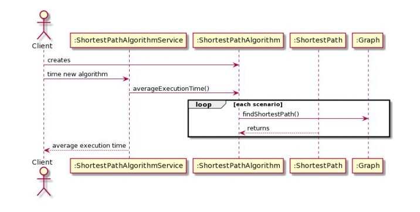

# Homework 3 - Part 2

## Date: 5/16/2020

## Final Class Diagram

## Final Sequence Diagram

## Questions

### To what extent did the peer’s design function?

### To what extent did the design favor composition over inheritance?

### To what extent did the design program to interfaces?

### To what extent was the design loosely coupled? Were there any trainwrecks?

### To what extent was the design cohesive? Did it violate Single Responsibility Principle anywhere?

### Was there anything that your peer’s design/notebook lacked that would have made life easier for you?

### In retrospect: was there anything that your notebook was lacking that would have made life easier for someone else?