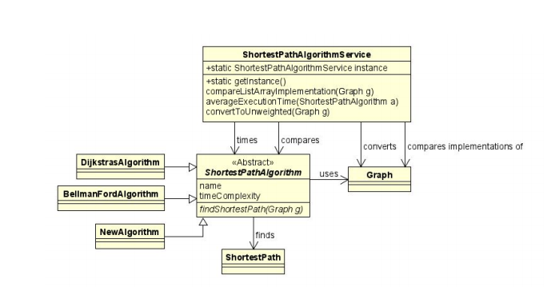

# Homework 3 - Part 2

## Date: 5/16/2020

## Final Class Diagram

## Final Sequence Diagram

## Questions

### To what extent did the peer’s design function?

I was unable to get the final design to properly function. The biggest problem with the design was that each individual algorithm was supposed to find the shortestPath.
This flat out won't work because the design needs to consider **all** the algorithms when finding the shortest path. The other issue was that the findShortestPath(Graph g) did not work because the Algorithms had no way of pulling off the needed
data from the Graph objects, specifically the starting node for the graphs that use list nodes. There is no way of accessing that value from the graph for lists, and therefore
there is no way of actually running the algorithm for the list implementations because the list needs the head node. However, the array implementations worked.
One issue that the design didn't mention was the need for there to be classes that represented array algorithms and list algorithms, which were not included in the
class diagram.

### To what extent did the design favor composition over inheritance?

There was no favoring composition over inheritance because there were no instances where the design composes behavior of objects.

### To what extent did the design program to interfaces?

The design does a good job programming to interfaces by using the ShortestPathAlgorithm class to inherit the responsibility of finding the shortestPathAlgorithm.
However it didn't really make sense for that to be the different algorithms to implement that class since the algorithms shouldn't be having running a method to find
the shortestPathAlgorithm, that should instead be done in the super class.

### To what extent was the design loosely coupled? Were there any trainwrecks?

The design did a good job by loosely coupling the classes and not having a lot of dependencies between the classes. Additionally, there were no present trainwrecks
with the design.

### To what extent was the design cohesive? Did it violate Single Responsibility Principle anywhere?

The design was not very cohesive. This was largely due to the fact that the design had the algorithms have the findShortestPath() method. This was bad for
a couple reasons. The first big reason is that this logic should take into consideration the results of several algorithms, and putting the findShortestPath() in
each algorithm defeats the purpose of actually finding the shortest path. Additionally it makes the design less cohesive because now these algorithm classes are not only doing their algorithm,
they are also trying to do the findShortestPath() as well.

### Was there anything that your peer’s design/notebook lacked that would have made life easier for you?

It would have been helpful for the findShortestPath() to not be done in the ShortestPathAlgorithm class, since that needed to have access to all of the actual algorithms.
Additionally, it would have been nice if the Graph class had both a ListGraph that had a pointer to the starting node so we would be able to pass it into the run() method.

### In retrospect: was there anything that your notebook was lacking that would have made life easier for someone else?

I probably should have included the objects that represented the array and the list versions of the Graph objects. This would have made my code easier to understand
and implement.